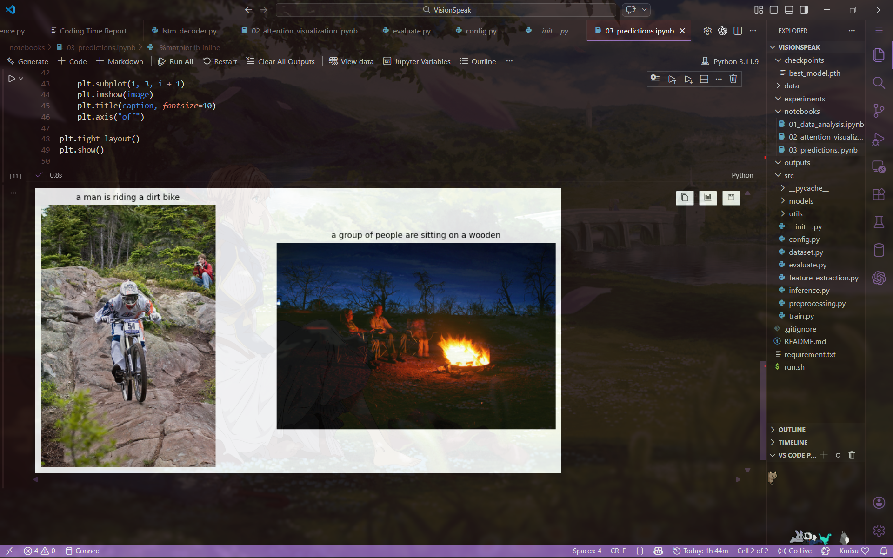
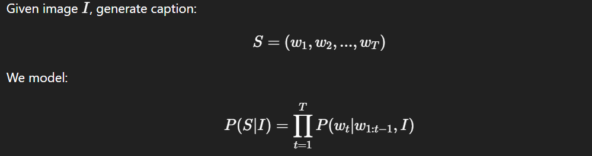

# 🖼️ VisionSpeak  
### Attention-Based Image Captioning System (CNN + LSTM + Additive Attention)

<p align="center">
  
</p>

---

## 📌 1. Project Overview

**VisionSpeak** is a deep learning–based image captioning system that generates natural language descriptions for images.

The system learns to:

- Extract spatial visual features from an image  
- Focus on different regions of the image while generating each word  
- Produce coherent captions using sequence modeling  
- Provide interpretable attention heatmaps  

### 🎯 Core Objective

> Given an image → Generate a grammatically meaningful caption describing the scene.

This project implements a classical **Encoder–Decoder architecture with Attention**.

---


## 🧠 2. Key Concepts (Important Terms)

### 🔹 Convolutional Neural Network (CNN)

A **CNN** is a deep learning architecture designed for image understanding.

It extracts hierarchical spatial features using convolutional filters.

In this project:

- A pretrained CNN is used to extract image features.
- Each image is converted into a spatial feature map of shape: ```(49, 2048)```

---

This represents:

- 7 × 7 spatial grid  
- 2048 feature dimensions per region  

These 49 feature vectors allow spatial attention.

---

### 🔹 Long Short-Term Memory (LSTM)

An **LSTM** is a type of Recurrent Neural Network (RNN) used for modeling sequential data.

It maintains:

- Hidden state (short-term memory)  
- Cell state (long-term memory)  

In this project:

- The LSTM generates captions word-by-word.
- At each timestep, it predicts the next word conditioned on:
  - Previous words
  - Visual context

---

### 🔹 Attention Mechanism

Attention allows the model to focus on different parts of the image while generating each word.

Instead of compressing the image into a single vector, attention:

- Computes weights over all 49 spatial regions  
- Produces a weighted combination (context vector)  
- Uses this context to generate the next word  

This makes the model:

- More accurate  
- More interpretable  

---

## 📐 3. Problem Definition

Image captioning is a multimodal task combining:

- Computer Vision (understanding image content)  
- Natural Language Processing (generating text)  


<p align="center">
  
</p>

The system learns to predict the next word conditioned on:

- Previous words  
- Visual features  

---

## 🏗️ 4. Architecture

### 🔹 4.1 Encoder

Instead of training a CNN from scratch, **pre-extracted CNN features** are used.

Each image representation:```Shape: (49, 2048)```


Corresponds to:

- 7 × 7 spatial grid  
- 2048-dimensional feature vector per region  

These allow spatial attention over image regions.

---

### 🔹 4.2 Decoder (LSTM + Attention)

Implemented components:

- Word embedding layer  
- LSTMCell decoder  
- Bahdanau attention mechanism  
- Fully connected vocabulary projection  

#### 🔁 Attention Flow Per Timestep

1. Compute attention weights over 49 spatial regions  
2. Generate context vector  
3. Concatenate context + embedding  
4. Pass through LSTM  
5. Predict next word  

This allows the model to dynamically focus on relevant image regions while generating words.

---

### 🔹 4.3 Beam Search Decoding

Instead of greedy decoding, **beam search** is implemented.

**Features:**

- Beam size = 3  
- Log probability scoring  
- UNK token blocking  
- Repetition penalty  
- Early stopping on `<end>`  
- Attention collection per word  

**Additional Decoding Improvements:**

- `<unk>` probability forced to -1e9  
- Immediate repetition prevention  
- Penalize repeated tokens in sequence  

---

## 🛠️ 5. What Was Implemented

### Core Modules

- Custom `Attention` class  
- Custom `LSTMDecoder`  
- Full `CaptionModel` (encoder + decoder)  
- Beam search decoding  
- Attention visualization  
- BLEU evaluation  
- Dataset preprocessing pipeline  
- Vocabulary building with frequency threshold  
- Train/validation split  
- Model checkpoint saving  
- JSON prediction export  
- Evaluation metrics export  

---

### Engineering Additions

- Repetition control in beam search  
- UNK token suppression  
- Attention length alignment fix  
- Gradient-safe inference  
- Visualization notebooks  
- Modular project structure  

---

## 📊 6. Training Details

- **Loss:** Cross Entropy  
- **Optimizer:** Adam  
- **Epochs trained:** 12  
- **Vocabulary size:** 5202  
- **Frequency threshold:** 2  
- **Beam size:** 3  

### Observed Training Behavior

- Training loss consistently decreased  
- Validation loss decreased initially  
- Slight overfitting after epoch 7  
- Best model saved based on validation loss  

---

## 📈 7. Evaluation Results

Evaluated on 200 validation samples.

- **BLEU-1:** 0.56  
- **BLEU-4:** 0.16  
- **Average Caption Length:** ~10.9  

### Interpretation

- BLEU-1 indicates strong word-level overlap.  
- BLEU-4 is moderate due to:
  - Limited dataset size  
  - Basic LSTM decoder  
  - No length normalization  
  - No advanced regularization  

---

## 🔥 8. Attention Visualization

For each predicted word:

- The model generates attention weights over 49 regions  
- These weights are upsampled and overlaid on the image  
- Heatmaps show spatial alignment between word and region  

**Example:**

- Word `"dog"` → attention focuses on dog region  
- Word `"riding"` → attention focuses on subject motion area  

This provides interpretability to the captioning process.

---


